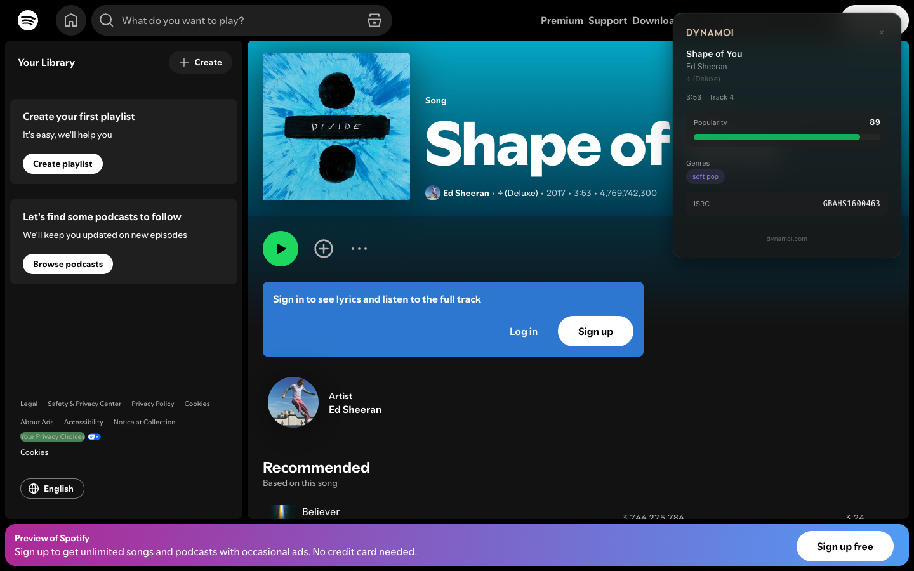

  

<h3 align="center">See the data behind the music.</h3>

  A free Chrome extension that overlays hidden Spotify metadata &mdash; popularity scores, audio features, genre tags, labels, ISRC codes, and more &mdash; right on <code>open.spotify.com</code>.

  <a href="https://dynamoi.com">Website</a>
  &middot;
  <a href="https://github.com/getDynamoi/browser-extension/issues">Report Bug</a>
  &middot;
  <a href="https://github.com/getDynamoi/browser-extension/issues">Request Feature</a>

  
  
  
  
  

 

  

---

## What It Does

Browse Spotify like normal. When you open a **track**, **album**, or **artist** page, a sleek overlay appears with enriched metadata that Spotify doesn't surface in its UI.

### Track Pages

- Popularity score with color-coded meter
- Duration, track number, explicit badge
- Artist genres as pill tags
- Audio features chart (danceability, energy, valence, and more)
- ISRC code (copyable)

### Album Pages

- Record label
- Artist names, release date, track count, album type
- Popularity score
- UPC code (copyable)
- Copyright info

### Artist Pages

- Follower count (formatted)
- Popularity score
- Genre tags

---

## License

MIT &mdash; see [LICENSE](LICENSE) for details.

---

  Built by <a href="https://dynamoi.com">Dynamoi</a> &mdash; Music marketing, powered by data.

